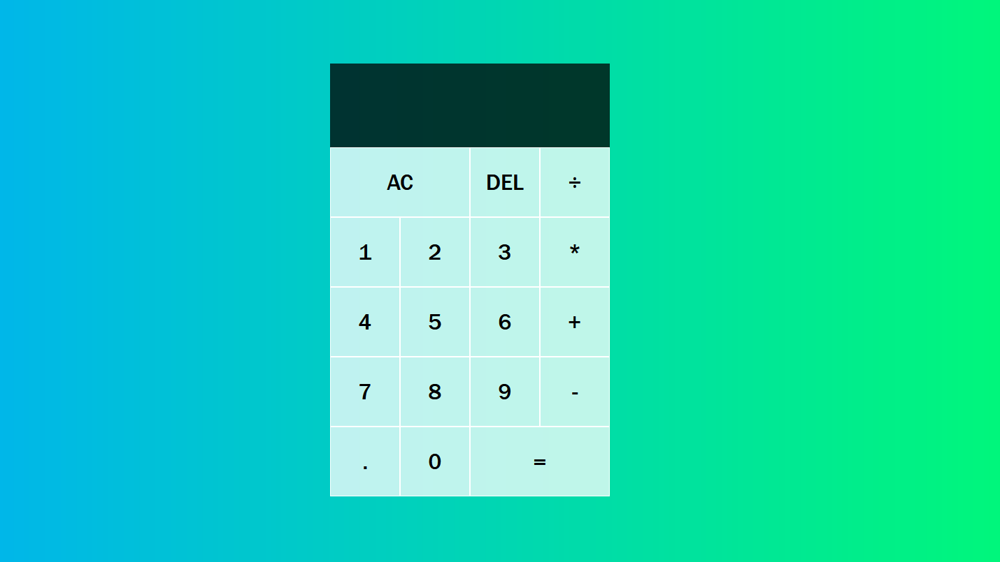

# **Calculator Project**

## **Overview**

This project is a *simple calculator* built with **JavaScript**, **HTML**, and **CSS**. The calculator supports basic arithmetic operations such as **addition**, **subtraction**, **multiplication**, and **division**. It also includes functionality to **clear input**, **delete individual digits**, and **display results dynamically**.

## **Potential Enhancements**

- Add support for more complex operations (e.g., *exponentiation*, *square root*).
- Include a history of calculations.
- Improve UI/UX with animations and responsive design.

## **License**

This project is **open-source** and free to use for *learning* and *personal projects*.

Made with Love by @Jasmeet Kaur

